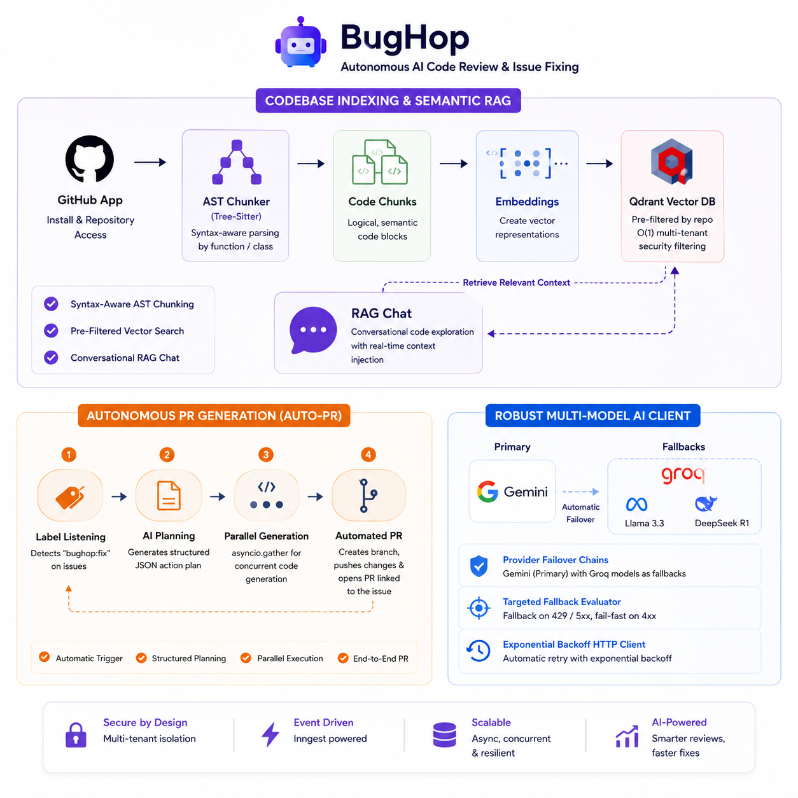
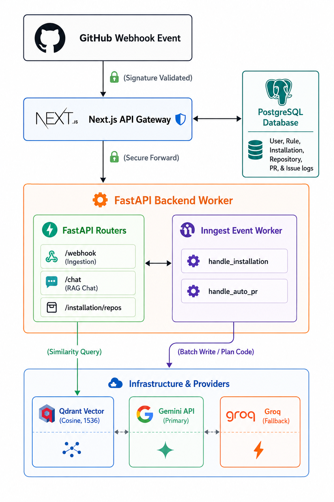
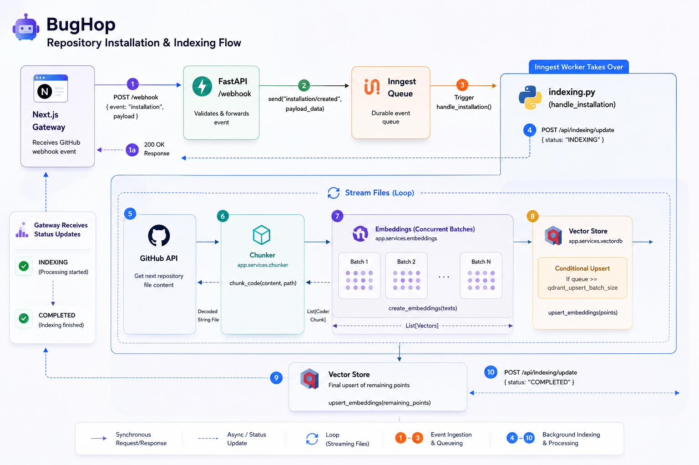
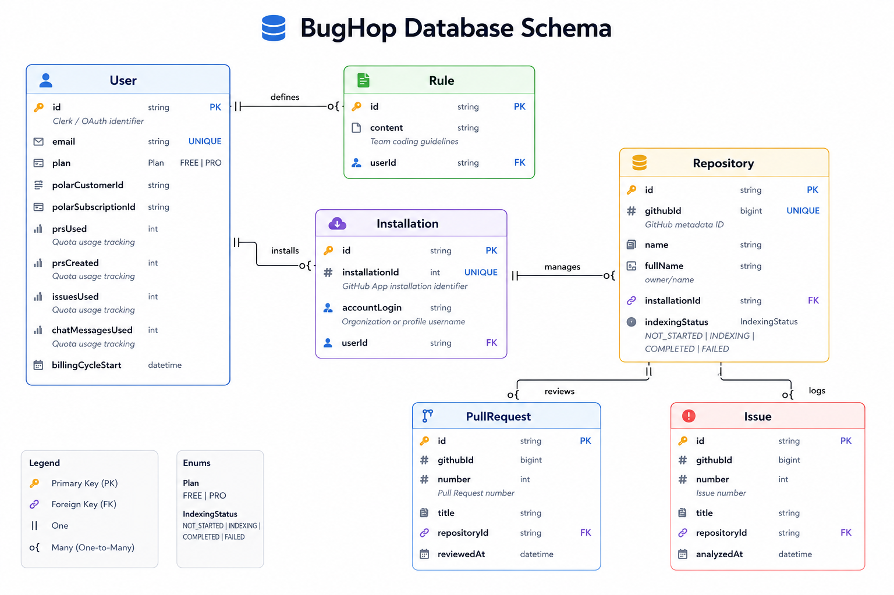

<div align="center">

<h1 align="center">
  
  <a href="https://bug-hop.vercel.app/">BugHop</a>
</h1>

### Autonomous AI code review & issue fixing

**BugHop** reviews PRs, fixes issues, and generates PRs automatically. Get consistent standards, contextual findings, and safer releases without slowing the team.

[](https://python.org/)
[](https://fastapi.tiangolo.com/)
[](https://www.typescriptlang.org/)
[](https://nextjs.org/)
[](https://clerk.com/)
[](https://prisma.io/)
[](https://inngest.com/)
[](https://qdrant.tech/)
[](https://tree-sitter.github.io/tree-sitter/)
[](https://deepmind.google/technologies/gemini/)

[Overview](#overview) · [Problem Statement](#problem-statement) · [Features](#features) · [Architecture](#architecture) · [Technology Stack](#technology-stack) · [API Reference](#api-reference) · [Getting Started](#getting-started) · [Database Schema](#database-schema) · [Limitations & Future Scope](#limitations--future-scope)

</div>

---

## Overview

**BugHop** is a high-concurrency, asynchronous AI coding agent built with a **FastAPI** web framework and a **Python 3.13** runtime. It demonstrates end-to-end modern software agent architectures—decoupled gateway-worker flows, syntax-tree AST semantic chunking, keyword pre-filtered Qdrant vector spaces, dual-provider automatic LLM routing, and event-driven multi-step Inngest background queues.

### Checkout the live application over here: **[BugHop](https://bug-hop.vercel.app/)**

---
## Problem Statement

Modern software teams ship faster than ever — but code review, debugging, and issue resolution workflows still remain heavily manual, fragmented, and time-consuming.

As repositories scale and engineering velocity increases, developers face several recurring challenges:

<div align="center">

| Challenge | Impact |
|---|---|
| Context switching across unfamiliar codebases | Slower debugging & reduced productivity |
| Manual PR reviews for coding standards | Review bottlenecks & delayed releases |
| Translating issues into actual code changes | Repetitive engineering effort |
| AI tools operating in isolation | Poor integration into real developer workflows |

</div>

---


**[BugHop](https://bug-hop.vercel.app/)** bridges this gap by serving as an autonomous, event-driven agent backend. It acts directly on repository webhooks to ingest issue metadata, dynamically crawls the repository syntax-tree (AST) to locate exact defect points, constructs semantic context patches via dual-provider LLM pipelines, and pushes self-healing Pull Requests autonomously—all while complying with user-defined workspace coding guidelines.

---

## Features



### Codebase Indexing & Semantic RAG

* **Syntax-Aware AST Chunker**: Traverses repository codebases using **Tree-Sitter** to parse abstract syntax trees (ASTs) for Python, TypeScript, Go, Java, and C++, dividing code by logical function and class nodes rather than blind character boundaries.

* **Pre-Filtered Vector Search**: Integrates with **Qdrant** with automatic inverted keyword indexing on repository payload attributes, enabling $O(1)$ multi-tenant security pre-filtering.

* **Conversational RAG Chat**: Real-time codebase exploration answering complex queries by injecting retrieved logical code blocks directly into LLM prompts.

### Autonomous PR Generation (Auto-PR)
* **Automatic Label Listening**: Intercepts GitHub issue labels, automatically starting fix routines when the `"bughop:fix"` label is added.

* **Structured AI Planning**: Formulates detailed JSON action files determining the exact files to modify, create, or delete based on issue details.

* **Parallelized Code Generation**: Leverages `asyncio.gather` to generate complete, modified file patches concurrently.

* **Automated Pull Requests**: Sets up target branches, pushes generated file modifications, and creates a comprehensive Pull Request linking back to the issue with standard closing triggers.

### Robust Multi-Model AI Client

* **Provider Failover Chains**: Configures **Google Gemini** as the primary worker, cascading dynamically to **Groq secondary models** (Llama 3.3, DeepSeek R1) on transient failures.

* **Targeted Fallback Evaluator**: Selectively fail-overs during HTTP 429 quota exhaustion or 5xx outages while instantly raising standard 4xx developer errors to block invalid loops.

* **Exponential Backoff HTTP Client**: Resilient REST connector executing calls with automatic retry loops and exponential sleep delays.

---

## Architecture

### System Architecture
BugHop operates on a **Decoupled Gateway-Worker Architecture**. All developer-facing dashboard logic, user authentication, subscription billing, and relational data operations are handled by a Next.js frontend gateway. The FastAPI backend is entirely stateless, dedicated to vector computing, syntax-tree code chunking, repository crawling, and LLM reasoning.



### Gateway Proxy and Verification
GitHub webhook deliveries are routed first to the Next.js gateway `/api/webhooks/github`. 

* **Security Verification**: Next.js verifies the cryptographic signature utilizing `@octokit/webhooks` and the `GITHUB_WEBHOOK_SECRET`.

* **State Registration**: If the event is `installation.created` or `pull_request.opened`, Next.js updates the PostgreSQL relational schema first to ensure strict user tracking.

* **Payload Forwarding**: Once validated and logged, Next.js performs an internal POST request forwarding `{ event, payload }` to the FastAPI backend's `/webhook` endpoint. This shields the backend from executing raw cryptographic validation and permits isolating it inside a private VPC.

### Stateless Vector Synchronization
The backend maintains no direct PostgreSQL connections. It synchronizes metadata and fetches workspace coding rules on-the-fly via HTTP REST endpoints exposed by Next.js:
* `GET /api/rules/by-installation/{installation_id}`: Retrieves the team's custom guidelines.
* `POST /api/indexing/update`: Transitions a repository's indexing state (`INDEXING`, `COMPLETED`, `FAILED`).
* `POST /api/logs/review`, `/api/logs/issue`, `/api/logs/pr`: Real-time event log sync representing reviews executed, issues analyzed, and pull requests autonomously generated.

---

## Technical Walkthrough of Lifecycles

### Codebase Indexing Sequence
Triggers when a user adds the GitHub App installation. This pipeline runs asynchronously in the background.




1. **Webhook Routing**: Next.js forwards the labeled issue event to the backend's `/webhook` endpoint. `handle_issue_labeled` (`app/handlers/issue.py`) verifies the label is `"bughop:fix"`, dispatches a background task (`issue/auto-pr`) to Inngest, and returns a `200` response immediately.

2. **Context Compilation**: The Inngest worker (`app/inngest/auto_pr.py`) queries the issue title and body, creates an embedding, and runs a similarity search in Qdrant for the top 10 most relevant code chunks inside the target repository. It compiles the unique file paths of these chunks and fetches their full contents and Git SHAs from the GitHub REST API.

3. **Plan Construction**: The worker passes the gathered file contents, search context, and the user's custom coding guidelines to `llm.plan_issues_fix`. The LLM responds with a structured JSON action plan detailing files to modify, create, or delete.

4. **Parallel Patch Generation & Git Push**: The worker processes file modifications concurrently using `asyncio.gather`. For each file, `llm.generate_file_change` generates the complete, modified code. It creates a new Git branch (`bughop/issue-{number}`) from the default branch and updates/deletes target files.

5. **PR Submission**: The worker creates a Pull Request on GitHub with a markdown summary linking back to the original issue (`Closes #{number}`), logs the PR generation to Next.js via `/api/logs/pr`, and posts a confirmation comment on the issue.

---

## Technology Stack

| Component | Technology | Purpose |
|---|---|---|
| **Language & Runtime** | Python 3.13 | Core backend language and execution environment |
| **App Framework** | FastAPI | High-performance asynchronous API framework |
| **ASGI Server** | Uvicorn | High-concurrency server hosting and hot-reloading |
| **Package Manager** | `uv` | Fast Python package installer and lockfile manager |
| **Background Queue** | Inngest | Event-driven serverless background queues |
| **AST Parser** | Tree-Sitter | Concrete syntax-tree semantic code chunker |
| **Vector Database** | Qdrant | Vector indexer & similarity search |
| **Embeddings Client** | Google text-embedding-004 | High-dimensional code representations |
| **LLM Provider** | Google Gemini (Primary) + Groq (Secondary) | Agent coding, planning, and code changes |
| **HTTP Client** | `httpx` | Asynchronous API client with backoff retries |
| **Configuration** | `pydantic-settings` | Schema-enforced environment variables |

---

## API Reference

### Webhook Ingestion
* **Endpoint**: `/webhook`
* **Method**: `POST`
* **Description**: Ingests forwarded GitHub webhook events from Next.js gateway
* **Payload Structure (`WebhookPayload`)**:
  ```json
  {
    "event": "issues",
    "payload": {
      "action": "opened",
      "issue": { "number": 42, "title": "...", "body": "..." },
      "repository": { "name": "...", "owner": { "login": "..." } },
      "installation": { "id": 12345 }
    }
  }
  ```
* **Response Structure (`WebhookResponse`)**:
  ```json
  {
    "status": "success",
    "message": null
  }
  ```

### RAG Chat Operations
* **Endpoint**: `/chat`
* **Method**: `POST`
* **Description**: Chat conversationally with repository code context
* **Payload Structure (`ChatPayload`)**:
  ```json
  {
    "question": "How are database connections pooled in this application?",
    "repo": "owner/repo-name"
  }
  ```
* **Response Structure (`ChatResponse`)**:
  ```json
  {
    "answer": "Based on the codebase context, database connections are managed via..."
  }
  ```

### Diagnostics & Metadata
* **Endpoint**: `/installation/{installation_id}/repos`
* **Method**: `GET`
* **Description**: Fetches accessible repository listings for a given GitHub App installation
* **Response Structure**:
  ```json
  {
    "repos": [
      { "id": 123, "name": "test-repo", "full_name": "owner/test-repo" }
    ]
  }
  ```
* **Endpoint**: `/health`
* **Method**: `GET`
* **Description**: Detailed system health check
* **Response Structure**:
  ```json
  {
    "status": "healthy",
    "checks": { "server": "ok", "qdrant": "ok" }
  }
  ```
* **Endpoint**: `/status-feed`
* **Method**: `GET`
* **Description**: Real-time service diagnostic feed checking FastAPI, Inngest, Qdrant, Google Embedding API, Google LLM credentials, and Razorpay
* **Response Structure**:
  ```json
  {
    "status": "operational",
    "services": {
      "backend_api": { "status": "operational", "detail": "FastAPI is running" },
      "vector_db": { "status": "operational", "detail": "Qdrant reachable" }
    }
  }
  ```

---

## Database Schema

While the backend is stateless, contributors should understand the PostgreSQL database schema managed by Prisma in the Next.js gateway (`schema.prisma`) to know how state updates are synchronized.



---

## Getting Started

### 1. Clone the repository

```bash
git clone https://github.com/anshdeshwal31/BugHop
cd backend
```

### 2. Configure environment properties
Create a local `.env` properties file:
```bash
cp .env.example .env
```
Fill in your configuration keys. For local development, set a Personal Access Token (`GITHUB_PAT`) to bypass full GitHub App JWT setup:
```properties
ENVIRONMENT=development
GOOGLE_API_KEY=your_gemini_api_key
QDRANT_URL=http://localhost:6333
GITHUB_PAT=your_github_personal_access_token
FRONTEND_URL=http://localhost:3000
```

### 3. Spin up local Qdrant Vector DB
```bash
docker run -p 6333:6333 -p 6334:6334 \
  -v $(pwd)/qdrant_storage:/qdrant/storage:z \
  qdrant/qdrant
```

### 4. Boot Inngest Dev Runner
```bash
npx inngest-cli@latest dev -u http://localhost:8000/api/inngest
```

### 5. Start the FastAPI server
```bash
uv run main.py
```

* **FastAPI Server**: Runs at `http://localhost:8000`. You can view the interactive OpenAPI endpoints at `http://localhost:8000/docs`.
* **Inngest Console**: Runs at `http://localhost:8288` (used to monitor asynchronous indexing and Auto-PR queues).
* **Qdrant Interface**: Runs at `http://localhost:6333/dashboard`.

---

## Limitations & Future Scope

### Current Limitations

- **Stateless Sync Overhead**: The backend avoids direct PostgreSQL connections and communicates through Next.js REST endpoints instead. While this improves isolation and scalability, it introduces additional network overhead and possible synchronization delays.

- **Limited Language Parsing Support**: Semantic indexing relies on Tree-Sitter grammars for selected languages. Unsupported languages fallback to basic chunking, reducing retrieval quality.

- **Scaling Constraints During Indexing**: Large monolithic repositories are still bounded by GitHub API rate limits, local memory usage, and concurrent crawl limits.

- **LLM Context Window Constraints**: Complex multi-file issues may exceed model context limits, leading to incomplete repository understanding or imperfect patch generation.

---

### Future Scope

- **Automated Test & CI Verification**  
  Integrate isolated execution sandboxes to run tests and iteratively repair failing patches before creating Pull Requests.

- **Fully Decoupled Webhook Security**  
  Move GitHub HMAC verification directly into the FastAPI worker for standalone deployments.

- **Graph-Based Code Understanding**  
  Upgrade from flat vector retrieval to AST/code-property graph representations for deeper dependency reasoning.

- **Expanded Multi-Language Support**  
  Add optimized parsing and semantic chunking support for languages like Rust, Ruby, PHP, and Swift.

---
