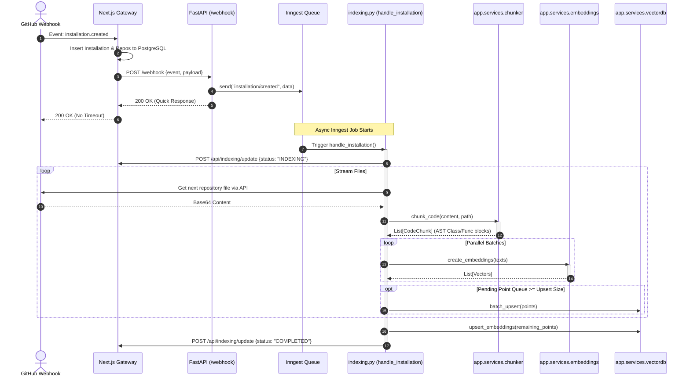
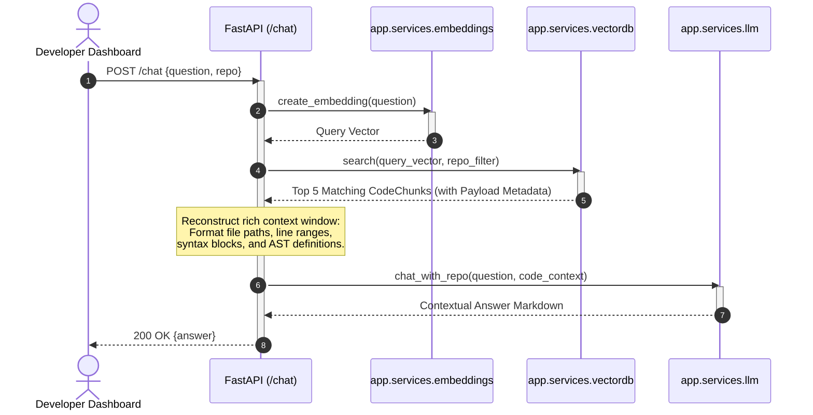

# API Workflow & Request Lifecycle

This document explains the API endpoints, workflow triggers, and detailed request lifecycles of the BugHop backend. It tracks exactly how data enters the system and moves across the synchronous and asynchronous execution boundaries.

---

## 1. API Endpoints Reference

The FastAPI backend exposes three main REST endpoint scopes and serves the Inngest execution endpoint.

### 1.1. Ingestion Endpoint (Webhooks)
* **`POST /webhook`**
  * **Description**: Ingests GitHub webhook events forwarded by the Next.js API gateway proxy.
  * **Payload (`WebhookPayload`)**:
    ```json
    {
      "event": "issues",
      "payload": {
        "action": "opened",
        "issue": { "number": 42, "title": "...", "body": "..." },
        "repository": { "name": "...", "owner": { "login": "..." } },
        "installation": { "id": 12345 }
      }
    }
    ```
  * **Response (`WebhookResponse`)**: `{ "status": "success" }`

### 1.2. Interactive API Endpoint (Conversational RAG)
* **`POST /chat`**
  * **Description**: Allows developers to chat with their codebases using semantic similarity search.
  * **Payload (`ChatPayload`)**:
    ```json
    {
      "question": "How are database connections pooled in this application?",
      "repo": "owner/repo-name"
    }
    ```
  * **Response (`ChatResponse`)**:
    ```json
    {
      "answer": "Based on the codebase context, database connections are managed via..."
    }
    ```

### 1.3. Metadata & Health Check Endpoints
* **`GET /installation/{installation_id}/repos`**
  * **Description**: Fetches the list of accessible repositories for a given GitHub App installation.
* **`GET /health`**
  * **Description**: Standard health check returning status code `200` if the FastAPI server is running and the Qdrant connection is healthy. Returns `500` otherwise.
* **`GET /status-feed`**
  * **Description**: Real-time service diagnostic endpoint checking:
    1. **Backend API**: Is FastAPI running?
    2. **Workflow Orchestrator**: Is Inngest mounted?
    3. **Vector DB**: Is Qdrant reachable?
    4. **Embedding Service**: Is Google embedding API functioning?
    5. **LLM Provider**: Is the Google API Key configured?
    6. **Billing Provider**: Is Razorpay reachable?
  * **Response**: Returns a comprehensive health feed indicating whether the system state is `"operational"` or `"degraded"`.

---

## 2. Request Lifecycles & Execution Flows

### 2.1. Codebase Indexing Flow (Asynchronous)
Triggered when a user installs BugHop on a GitHub repository. This flow utilizes Inngest to avoid hitting webhook timeouts.



---

### 2.2. Interactive Chat Flow (Synchronous)
Handles user Q&A queries against the codebase in real-time.



---

### 2.3. Autonomous Patch & PR Flow (Asynchronous)
Kicked off when a developer adds the `"bughop:fix"` label to a GitHub issue.

1. **Webhook Ingestion**:
   * Next.js validates the webhook signature and forwards the `"issues"` event (action `"labeled"`) to the backend `POST /webhook`.
   * The backend `handle_issue_labeled` checks if the label name is `"bughop:fix"`. If it is, it dispatches an `issue/auto-pr` event to Inngest and returns a `200` status.
2. **Retrieval & Context Assembly**:
   * The Inngest worker `handle_auto_pr` triggers.
   * It creates a search query by combining the issue title and body.
   * It generates a vector for this query and searches Qdrant for the top 10 most relevant code chunks within that repository.
   * It identifies the files where these chunks reside and fetches the **full file contents and Git SHAs** from the GitHub API.
3. **AI Planning**:
   * It sends the issue description, retrieved code blocks, full file contents, and custom user rules to the LLM via `llm.plan_issues_fix`.
   * The LLM analyzes the issue and returns a structured JSON plan containing a fix summary, list of files to change with target actions (`modify`, `create`, or `delete`), and an implementation description.
4. **Parallel Patch Generation**:
   * The worker maps the file plan to parallel execution tasks (`asyncio.gather`).
   * For each file, `llm.generate_file_change` generates the **complete modified code** (preventing placeholders or truncated strings).
5. **Git Execution**:
   * The worker queries the default repository branch (e.g. `main`).
   * It creates a new branch name: `bughop/issue-{issue_number}`.
   * It pushes all generated file modifications and deletions to the branch.
6. **PR Creation & Sync**:
   * It creates a Pull Request via GitHub with a detailed markdown description explaining the fix and linking the original issue with closing instructions (`Closes #{issue_number}`).
   * It registers the new PR in the PostgreSQL database via `/api/logs/pr`.
   * It posts a confirmation comment back on the original GitHub issue with the PR link.
