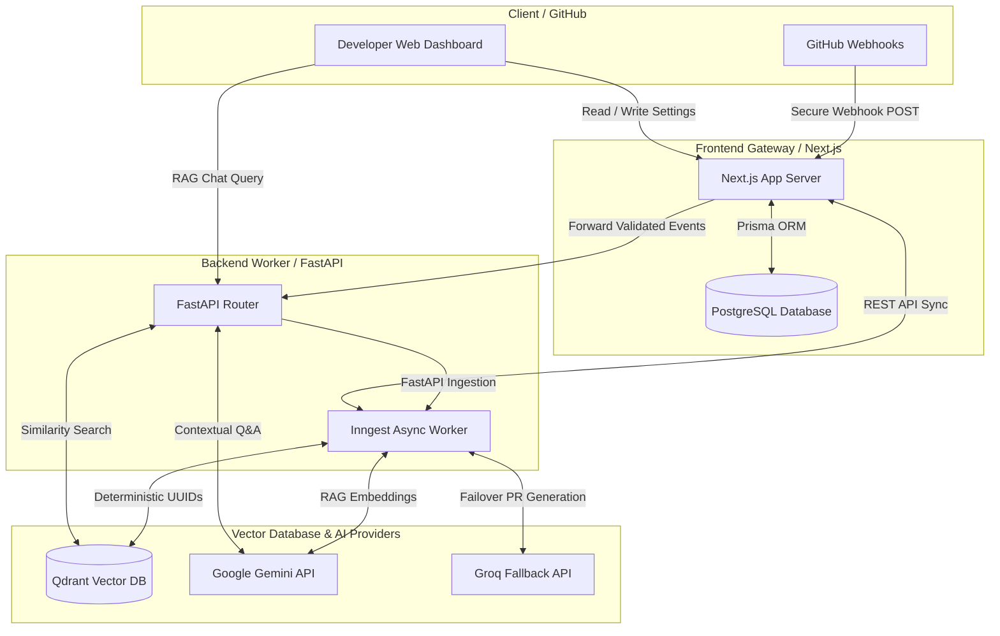
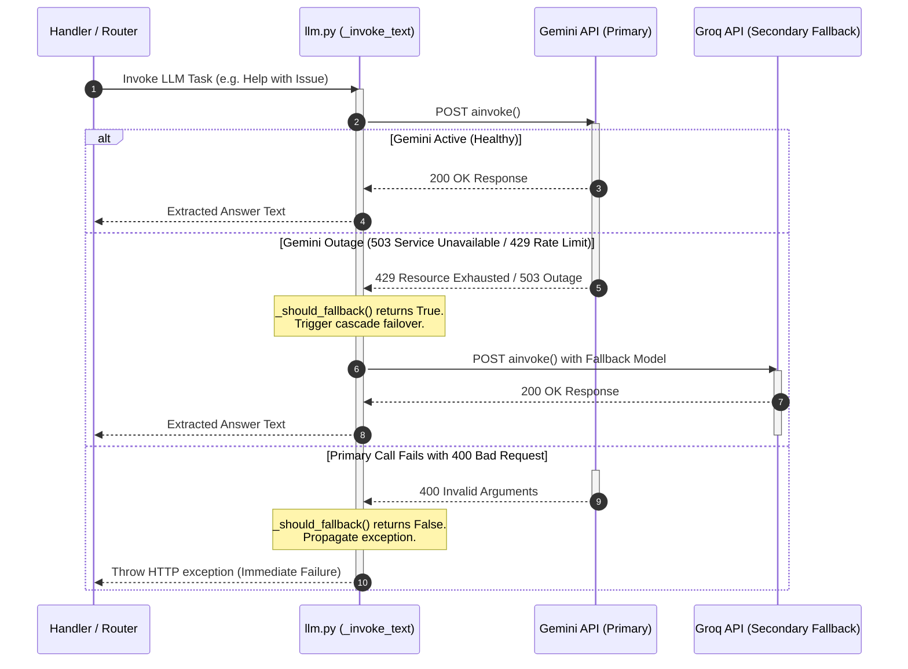

# BugHop Backend Architecture & Service Interaction

This document provides a deep, production-grade technical analysis of the **BugHop** backend architecture. It explains the design decisions, component layouts, service interactions, and engineering trade-offs made to build this enterprise AI coding assistant.

---

## 1. High-Level Architectural Pattern

BugHop is built using a **Decoupled Gateway-Worker Architecture**, separating user-facing CRUD, billing, and relational state management from high-intensity AI, vector database operations, and asynchronous codebase indexing.



### Key Design Rationale: Why Decoupled?
1. **Stateless Scalability**: The FastAPI backend contains **zero relational databases**. It does not maintain state, connections, or transaction managers. This allows the backend to be scaled horizontally to handle high-concurrency code chunking and embedding generation without database connection exhaustion.
2. **Gateway Proxy Pattern**: The Next.js frontend acts as an API gateway. It terminates SSL, handles user authentication, verifies cryptographic webhook signatures from GitHub, and enforces quota/billing limits. It then forwards clean, verified JSON events to the backend.
3. **Database Isolation**: Next.js serves as the single source of truth for the PostgreSQL database (via Prisma). The backend interacts with the relational database solely via high-performance REST endpoints defined in the frontend, preventing database lockups and schema synchronization issues.

---

## 2. Component Directory Breakdown

The backend codebase is organized as follows under `backend/app/`:

```
backend/
├── main.py                     # App entrypoint, startup lifecycle, & health checks
└── app/
    ├── core/
    │   └── config.py           # Configuration management (Pydantic-Settings & LRU Cache)
    ├── routers/
    │   ├── webhooks.py         # Ingestion router for forwarded events
    │   ├── chat.py             # RAG-based conversational repository exploration
    │   └── installation.py     # GitHub App installation metadata management
    ├── handlers/
    │   ├── installation.py     # Decoupler dispatching repository indexing
    │   ├── issue.py            # Opened issue analyzer & bughop:fix listener
    │   └── pull_request.py     # Automated bot-filtered PR reviewer
    ├── inngest/
    │   ├── client.py           # Inngest asynchronous client initialization
    │   ├── indexing.py         # Asynchronous repository crawler, chunker & indexer
    │   └── auto_pr.py          # Autonomous PR planning & parallel patch generator
    └── services/
        ├── chunker/
        │   ├── languages.py    # Tree-Sitter AST node mappings
        │   └── parser.py       # Syntax-tree chunking & prompt formatting
        ├── embeddings.py       # Embedding API adapter with safe retry/fallback
        ├── vectordb.py         # Qdrant client adapter with keyword indexing
        ├── frontend.py         # Sync client for Next.js database gateway
        └── llm.py              # LLM client with multi-provider failover
```

---

## 3. Detailed Service Interactions

### 3.1. Chunker & AST Parser Service (`app.services.chunker`)
Most generic RAG pipelines split text arbitrarily by character count (e.g. 500 characters with 50 character overlap). This approach is **detrimental** to codebases because it splits functions and classes in half, severing variables from their logical contexts. 

BugHop uses a **Syntax-Aware Tree-Sitter Chunker**:
1. **Language Map (`languages.py`)**: Maps file extensions to specific tree-sitter language libraries (Python, Go, TSX, Rust, etc.) and specifies language-specific syntax nodes for class declarations (`CLASS_NODES`) and function definitions (`FUNCTION_NODES`).
2. **Parser (`parser.py`)**: 
   - Decodes repository file contents and generates a concrete Abstract Syntax Tree (AST).
   - Recursively walks the tree (`walk_tree`). When it hits a registered function or class node, it extracts the exact start/end lines, name, and complete syntax-valid code block.
   - For unstructured or unconfigured file formats, it falls back to a safe `"file"` chunking strategy.
3. **Structured Prompt Injection (`create_chunk_text_for_embedding`)**: Formats AST nodes with structural metadata (e.g. `File: main.py | Class: VectorDB | Function: search`) inside fenced markdown blocks before passing them to the embedding model. This allows the vector similarity algorithm to index pathnames and logical structure in addition to raw code semantics.

### 3.2. Vector Database Service (`app.services.vectordb`)
BugHop interfaces with **Qdrant** using highly optimized structural configurations:
- **Keyword Indexing**: During startup (`init_collection` in `main.py`), a payload index of type `PayloadSchemaType.KEYWORD` is programmatically created on the `"repo"` payload property. This is a critical production optimization: it allows Qdrant to perform `O(1)` pre-filtering on repository names, preventing queries from scanning vectors belonging to other repositories.
- **Batched Operations**: To avoid excessive memory allocations and HTTP payload overflows on large codebases, `upsert_embeddings` chunks vectors into standard batch sizes (`settings.qdrant_upsert_batch_size`).

### 3.3. Dual-Provider LLM Client with Cascade Failover (`app.services.llm`)
The LLM client is built for high availability and resilient operations, eliminating single points of failure (SPF) on AI providers:
- **Primary & Secondary Chains**: Configures **Google Gemini** (`ChatGoogleGenerativeAI`) as the primary worker, with a fallback chain of **Groq models** (`ChatGroq`) including `llama-3.3-70b-versatile`, `deepseek-r1-distill-llama-70b`, and `mixtral-8x7b-32768`.
- **Intelligent Error Handling (`_should_fallback`)**:
  - **429 Rate Limits / Quotas / 5xx Server Outages**: Trigger an immediate, automatic cascade to the next provider.
  - **4xx Bad Requests / Auth Errors**: Do **not** trigger a failover. They are immediately thrown to the application caller, preventing endless fallback loops on invalid prompts or configuration keys.
- **Dynamic Threading**: Synchronous LangChain wrappers are executed inside worker threads using `asyncio.to_thread` where appropriate to keep the main event loop non-blocking.



### 3.4. Frontend Relational Sync Service (`app.services.frontend`)
This service links the stateless FastAPI backend with Next.js database operations over secure HTTP calls:
- **`/api/rules/by-installation/{id}`**: Fetches customized styling/guideline rules configured by the repository owner, dynamically injecting them into LLM code-generation prompts.
- **`/api/indexing/update`**: Synchronizes indexing lifecycle states (`INDEXING`, `COMPLETED`, `FAILED`) to update relational database fields.
- **`/api/logs/...`**: Real-time event logger recording PR reviews created, issues analyzed, and patches generated, enabling granular usage-metric reporting.
